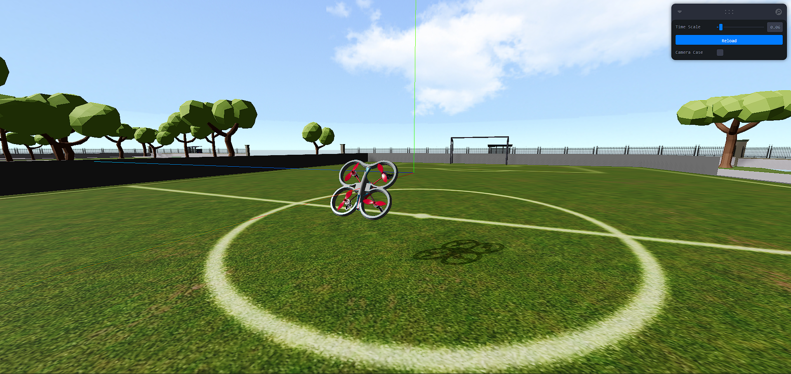

# Drone-Sim
A simple drone simulator for testing control algorithms. Rendered using [Three.js](https://threejs.org/) and differentiable physics engine backend coded in Python using PyTorch. The animations are loaded in the browser usign HTTP requests to the Python FastAPI server. The server runs the physics engine and returns the updated state of the drone to the browser. The optimal path is calculated using backpropagation through time (BPTT) and the PyTorch autograd package.

# How to run
1. Clone the repository
2. Change directory `cd .\backend`
3. Install the required packages using `pip install -r requirements.txt`
4. Change directory `cd .\app` and run `python -m uvicorn main:app --reload`
5. Now cd into frontend `cd .\frontend` and run `npm install`
6. Finally run `npm run dev` and open `http://localhost:5173/` in your browser